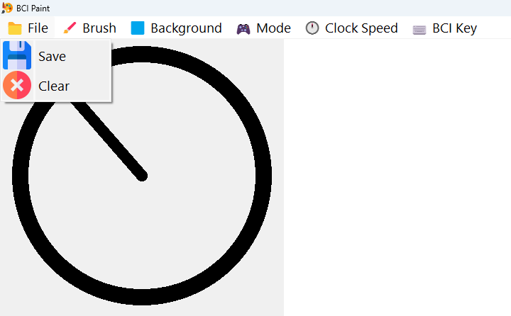
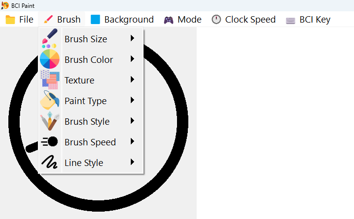
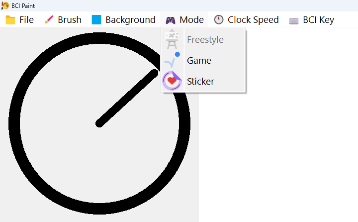
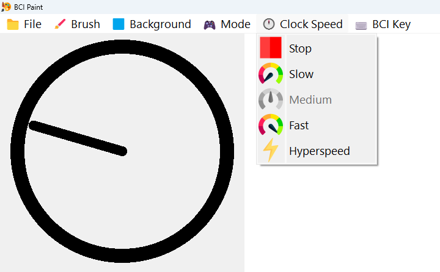

<!-- PROJECT LOGO -->
 

  

<h3 align="center">BCI Paint</h3>

  

    This is a repo for the BCI enabled painting program.
  

<!-- TABLE OF CONTENTS -->

Table of Contents

<ol>
  <li>
    <a href="#about-the-project">About The Project</a>
    <ul>
      <li><a href="#how-it-works">How it Works</a></li>
    </ul>
  </li>
  <li>
    <a href="#getting-started">Getting Started</a>
    <ul>
      <li><a href="#prerequisites">Prerequisites</a></li>
      <li><a href="#building-the-project">Building the Project</a></li>
    </ul>
  </li>
  <li><a href="#contributing">Contributing</a></li>
  <li><a href="#license">License</a></li>
  <li><a href="#acknowledgments">Acknowledgments</a></li>
</ol>

# About the Project
This project was developed for the Imagination Centre BCI Program at the Glenrose Rehabilitation Hospital. The purpose of this app is to enable people with severely limited physical mobility access to paint.

  

## How it works
This app uses the GRH-Home-BCI app at https://github.com/GRH-BCI for input in the form of a key press, which moves the brush.

Using the clock animation and timing, the user can control the direction the brush moves. The brush can also be controlled with the four arrow keys.

The File menu is where the painting can be saved as PNG or JPEG file and the canvas can be cleared.

The Brush menu allows you to adjust the properties of the brush
  * **Brush Size:** size of the brush
  * **Brush Colour:** colour of the brush
  * **Paint Type:** the type of paint to use
  * **Brush Style:** style of the paint stroke
  * **Brush speed:** how far the brush moves in one stroke
  * **Line style:** solid or dotted paint stroke

The Mode menu allows you to switch between freestyle and game mode
  * **Freestyle:** fine control over the movement of the brush
  * **Game:** the brush bounces of the edges of the canvas

The clock speed (how fast the indicator for the direction of the brush changes) can be adjusted using the Clock Speed menu
  * The stop button can stop the clock if the user wants to draw a line in a particular direction.
  * With hyperspeed you can draw a circle if the command can be held for long enough

The BCI Key menu allows the user to match the key that activates the brush to the selected key in the GRH-Home-BCI app that gets pressed when the command is activated.

# Getting Started
## Prerequisites
* PyQt5: https://pypi.org/project/PyQt5/
* PyInstaller: https://pypi.org/project/pyinstaller/
  * PyInstaller is used to create an executable for the app

## Building the Project
1. Download the source code
2. Unzip the folder
3. Navigate to the folder in your preferred IDE or in the terminal and run `pyinstaller --add-data="Assets;Assets" --icon="Assets/favicon.ico" --noconsole main.py`
4. A 'dist' folder should be created and the exectuable "main.exe" should be inside the 'main' folder in the 'dist' folder
5. Double click on main.exe to run the app!

# Contributing
Contributions are welcome and will help progress the development of BCI acessible applications!

If you have a suggestion that would make this better, please fork the repo and create a pull request.

# License
Distributed under the MIT License. See `LICENSE.txt` for more information.

# Acknowledgments

This program modifies and extends the example code from the following source:
 
Article: https://www.geeksforgeeks.org/pyqt5-create-paint-application/
 
Link to the Author: https://auth.geeksforgeeks.org/user/rakshitarora/articles
 
Link to License used by geeksforgeeks: https://creativecommons.org/licenses/by-sa/2.0/

## Images:

Images from the following sources are used in the program:

* Paint Palette Icon: <a href="https://www.flaticon.com/free-icons/painting" title="painting icons">Painting icons created by Freepik - Flaticon</a>
* Paint Type Icon:
<a href="https://www.flaticon.com/free-icons/paint-bucket" title="paint-bucket icons">Paint-bucket icons created by BZZRINCANTATION - Flaticon</a>
* Acrylic: <a href="https://www.flaticon.com/free-icons/paint" title="paint icons">Paint icons created by Smashicons - Flaticon</a>
* Marker Icon: <a href="https://www.flaticon.com/free-icons/highlighter" title="highlighter icons">Highlighter icons created by Freepik - Flaticon</a>
* Watercolour Icon: adapted from <a href="https://www.flaticon.com/free-icons/watercolor" title="Watercolor icons">Watercolor icons created by Freepik - Flaticon</a>
* Spray Paint Icon: <a href="https://www.flaticon.com/free-icons/art-and-design" title="art and design icons">Art and design icons created by Freepik - Flaticon</a>
* Splatter Icon: <a href="https://www.flaticon.com/free-icons/splatter" title="splatter icons">Splatter icons created by Smashicons - Flaticon</a>
* Graffiti Icon: <a href="https://www.flaticon.com/free-icons/splatter" title="splatter icons">Splatter icons created by Freepik - Flaticon</a>
* Abstract Icon: <a href="https://www.flaticon.com/free-icons/square" title="square icons">Square icons created by Freepik - Flaticon</a>
* Slow Icon: <a href="https://www.flaticon.com/free-icons/performance" title="performance icons">Performance icons created by Freepik - Flaticon</a>
* Medium: <a href="https://www.flaticon.com/free-icons/speedometer" title="speedometer icons">Speedometer icons created by Freepik - Flaticon</a>
* Fast Icon: <a href="https://www.flaticon.com/free-icons/speedometer" title="speedometer icons">Speedometer icons created by Freepik - Flaticon</a>
* Hyperspeed Icon: <a href="https://www.flaticon.com/free-icons/thunder" title="thunder icons">Thunder icons created by Freepik - Flaticon</a>
* Game Icon: <a href="https://www.flaticon.com/free-icons/bounce-rate" title="bounce rate icons">Bounce rate icons created by Royyan Wijaya - Flaticon</a>
* Freestyle Icon: <a href="https://www.flaticon.com/free-icons/easel" title="easel icons">Easel icons created by Freepik - Flaticon</a>
* Colour Icon: <a href="https://www.flaticon.com/free-icons/circle" title="circle icons">Circle icons created by Freepik - Flaticon</a>
* Brush Size Icon: <a href="https://www.flaticon.com/free-icons/graphic-design" title="graphic-design icons">Graphic-design icons created by Freepik - Flaticon</a>
* Line Style Icon: <a href="https://www.flaticon.com/free-icons/scribble" title="scribble icons">Scribble icons created by Rahul Kaklotar - Flaticon</a>
* Brush Syles Icon: <a href="https://www.flaticon.com/free-icons/draw" title="draw icons">Draw icons created by photo3idea_studio - Flaticon</a>
* Save Icon: <a href="https://www.flaticon.com/free-icons/save" title="save icons">Save icons created by Freepik - Flaticon</a>
* Delete Icon: <a href="https://www.flaticon.com/free-icons/delete" title="delete icons">Delete icons created by Freepik - Flaticon</a>
